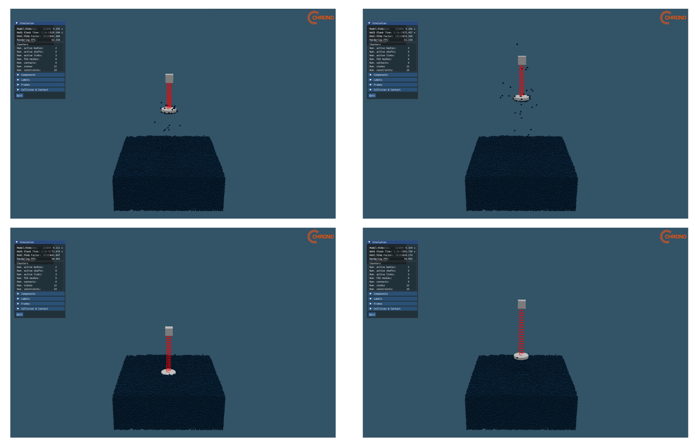
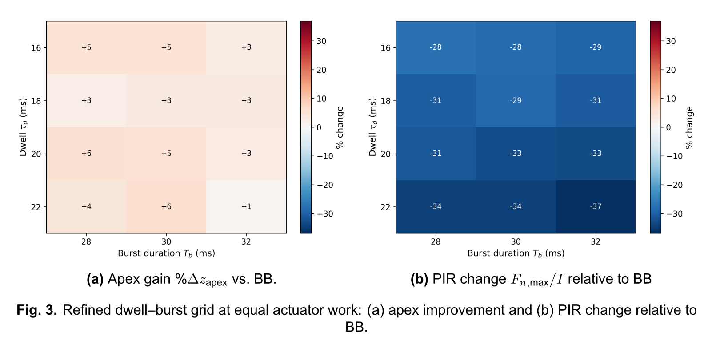
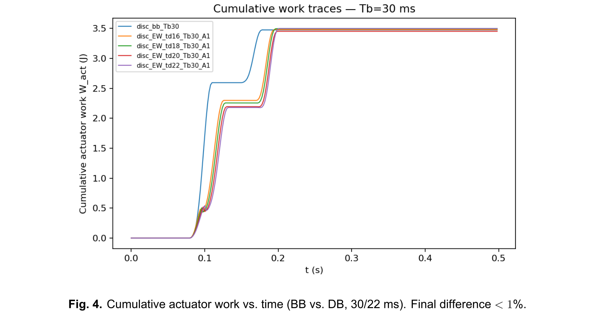

# Temporal Actuation Shaping for Granular Jumping (Project Chrono DEM–MB)

GPU-accelerated DEM–multibody co-simulation of a spring–mass hopper on granular regolith to study **how actuation timing changes jump height and peak loads under a fixed energy budget**.

  <!-- Replace with your GIF or embed a short video -->
  

**Key result (equal actuator work):**  
A **dwell–burst (DB)** schedule with **~20–22 ms dwell + ~30 ms burst** achieves a consistent Pareto improvement over a bang–bang (BB) burst:
- **Apex height:** **+5–6%**
- **Peak load & peak-to-impulse ratio (PIR):** **~30% lower**
- **Efficiency:** **+5–6%**
Replicated across random granular packings (seeds).

---

## Why this matters
On dry granular terrain, reaction forces depend on **intrusion depth and speed** (with inertial / added-mass effects). That means **timing is a first-order design variable**, not just total energy. This project gives a **reproducible simulation pipeline + a practical timing design rule** for hopping/jumping robots on yielding ground.

---

## Highlights (what I built)
- **Chrono co-simulation pipeline**: GPU DEM bed + multibody spring–mass mechanism with two-way coupling.
- **Calibration** against canonical granular benchmarks:
  - Sphere-drop scaling tests and quasi-static indentation to estimate near-surface stiffness.
- **Equal-work normalisation**: DB amplitude solved via bisection so DB and BB deliver the same net actuator work (≤1% mismatch).
- **Parameter sweeps + refinement**: coarse grid → refined grid around a “sweet spot”, then **seed robustness** checks.

---

## Results (figures)
### Coarse sweep: dwell/burst trade-off
Short bursts boost height but increase “spikiness” (PIR); longer dwell softens contact but can reduce apex.

  
  <!--  -->

### Refined sweep: sweet spot around 30 ms burst + 20–22 ms dwell
This regime improves both height **and** peak-load metrics at equal work.

  
  <!--  -->

### Equal-work fairness check
Work traces converge tightly (typ. <1% final mismatch), ensuring a fair comparison.

  

---

## Design rule (takeaway)
**Establish a shallow preload (dwell), then apply a short burst while keeping intrusion speed moderate through depths where inertial / grain recruitment effects are strongest.**  
This reduces dynamic losses and force spikes *without requiring more work*.

---

## Method summary
### Simulation
- **Project Chrono** co-simulation: Chrono::Gpu (soft-sphere DEM) + Chrono::SMC (multibody smooth contact).
- Internal units in **cgs**, fixed step **Δt = 2.5e−5 s**, resampled to **500 Hz** for analysis.

### Granular bed
- Monodisperse spheres, rolling resistance to approximate angularity.
- Calibrated with:
  - **Sphere drop**: penetration vs dynamic-load parameter.
  - **Disk indentation**: near-surface stiffness (effective k_eff).

### Hopper surrogate
- Vertical foot–spring–body (1-DOF along z):
  - Rigid foot disc + body mass linked by TSDA spring-damper.
- Actuation is a **rest-length command** with two schedules:
  - **BB**: single burst.
  - **DB**: dwell then burst.

### Equal-work comparison (fairness)
Net actuator work is computed from actuator power and matched between schedules:
- Solve DB amplitude **A\*** via bisection so **|W_DB(A*) − W_BB| / W_BB ≤ 1%**.

---

## Repository contents
- `Sweep_dwell_burst.cpp` — sweep driver (DB vs BB, equal-work solve)
- `postprocess_make_figs.py` — plotting and analysis

**Recommended structure (optional cleanup):**
